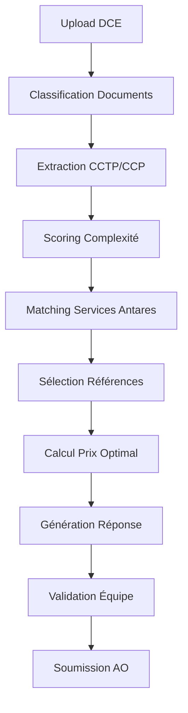

# 📋 **SPÉCIFICATIONS FONCTIONNELLES - ANTARES TENDER ASSISTANT**

*Spécifications détaillées des fonctionnalités Phase 1*

## 🎯 **VUE D'ENSEMBLE FONCTIONNELLE**

### **Objectifs Utilisateur**
- **Bid Manager Antares** : Analyser rapidement DCE et préparer réponses optimisées
- **Équipe Commerciale** : Identifier opportunités et évaluer faisabilité
- **Direction** : Piloter performance AO et optimiser stratégie commerciale

### **Flux Utilisateur Principal**
1. **Upload DCE** → Parsing automatique → Analyse complexité
2. **Consultation catalogue** → Sélection services Antares pertinents  
3. **Matching références** → Identification cas succès similaires
4. **Calcul prix** → Estimation automatique avec facteurs
5. **Génération réponse** → Assistance rédaction avec contexte

---

## 📊 **F1 - PARSING DCE INTELLIGENT**

### **F1.1 - Upload et Classification Documents**

#### **Description**
Interface d'upload permettant de déposer un dossier DCE complet et d'obtenir une classification automatique de chaque document.

#### **Critères d'Acceptation**
- ✅ **Upload multi-fichiers** : Glisser-déposer jusqu'à 20 fichiers simultanément
- ✅ **Formats supportés** : PDF, DOC, DOCX (taille max 10MB/fichier)
- ✅ **Classification automatique** :
  - CCTP (Cahier Clauses Techniques) : 95% précision
  - CCP (Cahier Clauses Particulières) : 90% précision  
  - BPU (Bordereau Prix Unitaires) : 85% précision
  - RC (Règlement Consultation) : 90% précision
  - Autres documents : Classification "AUTRE"
- ✅ **Interface correction** : Possibilité modifier classification si confiance < 80%
- ✅ **Temps traitement** : < 30 secondes pour ensemble DCE typique

#### **Interface Utilisateur**
```typescript
// Composant UploadDCE
<UploadZone onFilesAdded={handleFilesUpload}>
  <ClassificationResults files={classifiedFiles}>
    {files.map(file => (
      <FileClassification
        file={file}
        type={file.classification}
        confidence={file.confidence}
        onCorrection={handleManualCorrection}
      />
    ))}
  </ClassificationResults>
</UploadZone>
```

#### **Données de Sortie**
```json
{
  "files": [
    {
      "filename": "CCTP_Infrastructure.pdf",
      "classification": "CCTP", 
      "confidence": 0.96,
      "pages": 24,
      "size": "2.3MB"
    }
  ],
  "processingTime": "12.3s",
  "overallConfidence": 0.92
}
```

### **F1.2 - Extraction Structurée CCTP**

#### **Description** 
Analyse en profondeur du Cahier des Clauses Techniques Particulières pour extraire les informations techniques essentielles.

#### **Critères d'Acceptation**
- ✅ **Objet du marché** : Extraction automatique périmètre et enjeux
- ✅ **Exigences techniques** : Distinction claire obligatoires vs recommandées
- ✅ **Standards et normes** : Identification ANSSI, ISO27001, ITIL, etc.
- ✅ **Technologies** : Détection technologies imposées vs ouvertes au choix
- ✅ **Contraintes temporelles** : Extraction délais et jalons critiques
- ✅ **Niveaux de service** : SLA, disponibilité, performance requis
- ✅ **Documentation** : Liste livrables documentaires attendus
- ✅ **Compétences équipe** : Certifications et expertises requises

#### **Algorithme d'Extraction**
```typescript
// Extraction par sections avec IA contextuelle
const extractCCTP = async (document: ProcessedDocument) => {
  const sections = await analyzeDocumentStructure(document);
  
  return {
    marketScope: await extractMarketScope(sections.introduction),
    technicalRequirements: await extractTechnicalReqs(sections.technical),
    mandatorySpecs: await identifyMandatorySpecs(sections.specifications),
    standardsRequired: await extractStandards(sections.compliance),
    servicelevels: await extractSLAs(sections.performance),
    timeline: await extractTimeline(sections.planning),
    deliverables: await extractDeliverables(sections.deliverables)
  };
};
```

#### **Structure de Sortie**
```json
{
  "marketScope": {
    "title": "Migration infrastructure cloud hybride",
    "description": "Migration 200 serveurs vers plateforme Azure/AWS",
    "businessValue": "Modernisation SI et réduction coûts 30%"
  },
  "technicalRequirements": {
    "mandatory": [
      "Certification ISO27001 équipe",
      "Disponibilité 99.9% minimum", 
      "Migration zero-downtime"
    ],
    "recommended": [
      "Expérience VMware vSphere",
      "Méthodologie ITIL"
    ]
  },
  "technologies": {
    "imposed": ["Microsoft Azure", "VMware vSphere"],
    "openChoice": ["Outils monitoring", "Solution backup"]
  }
}
```

### **F1.3 - Scoring Complexité Automatique**

#### **Description**
Algorithme de calcul automatique du niveau de complexité d'un AO sur une échelle 1-10.

#### **Facteurs de Complexité**
| Facteur | Poids | Calcul |
|---------|--------|--------|
| **Nombre technologies** | 20% | 1 techno = 1pt, 5+ technos = 10pts |
| **Niveau sécurité** | 25% | Standard = 2pts, ANSSI = 8pts, Défense = 10pts |
| **Contraintes temporelles** | 15% | >6 mois = 1pt, <3 mois = 8pts, <1 mois = 10pts |
| **Volume fonctionnel** | 20% | Scope limité = 2pts, Enterprise = 8pts |
| **Intégrations tierces** | 10% | Aucune = 1pt, >5 systèmes = 8pts |
| **Certifications requises** | 10% | Aucune = 1pt, PASSI = 10pts |

#### **Algorithme**
```typescript
const calculateComplexity = (analysis: CCTPAnalysis): ComplexityScore => {
  const factors = {
    technology: calculateTechnologyFactor(analysis.technologies),
    security: calculateSecurityFactor(analysis.standards),
    timeline: calculateTimelineFactor(analysis.timeline),
    scope: calculateScopeFactor(analysis.marketScope),
    integrations: calculateIntegrationFactor(analysis.integrations),
    certifications: calculateCertificationFactor(analysis.certifications)
  };
  
  const weightedScore = 
    factors.technology * 0.20 +
    factors.security * 0.25 +
    factors.timeline * 0.15 +
    factors.scope * 0.20 +
    factors.integrations * 0.10 +
    factors.certifications * 0.10;
    
  return {
    score: Math.round(weightedScore),
    factors,
    justification: generateJustification(factors),
    preparationDays: estimatePreparationTime(weightedScore, analysis)
  };
};
```

#### **Validation et Calibrage**
- ✅ **Précision ±1 point** vs évaluation expert sur 20 AO de référence
- ✅ **Cohérence temporelle** : AO similaires → scores similaires
- ✅ **Justification explicite** : Détail des facteurs de complexité

### **F1.4 - Dialogue Conversationnel DCE** 🆕

#### **Description**
Interface de chat conversationnel permettant au bid manager d'interagir avec l'IA pour analyser en profondeur les documents DCE et obtenir des insights stratégiques personnalisés.

#### **Fonctionnalités Conversationnelles**

**🗣️ Questions Naturelles**
```typescript
// Exemples d'interactions naturelles
const conversationExamples = [
  {
    bidManager: "Quels sont les principaux risques de cet appel d'offres ?",
    assistant: "J'identifie 4 risques critiques : 1) Clause pénalité 2% CA si retard (p.23 CCP), 2) Certification PASSI exigée (non négociable), 3) Référence similaire <3 ans obligatoire, 4) Sous-traitance limitée 30%"
  },
  {
    bidManager: "Sur quoi Antares peut se différencier ?",
    assistant: "3 leviers différenciants : • Référence Ministère Défense 2023 (match parfait CCTP), • Double certification PASSI + ISO27001, • Méthodologie zéro-downtime exclusive"
  },
  {
    bidManager: "Explique-moi pourquoi ce marché est classé complexité 8/10",
    assistant: "Score justifié par : Sécurité ANSSI (4 pts), Intégration 12 systèmes (3 pts), Délai 45 jours (1 pt). Détail facteurs en section 4.2 CCTP."
  }
];
```

**🎯 Questions Suggérées Intelligentes**
```typescript
interface SuggestedQuestions {
  riskAnalysis: [
    "Quels sont les risques contractuels majeurs ?",
    "Y a-t-il des pénalités significatives ?",
    "Quelles certifications sont obligatoires ?"
  ];
  competitiveAdvantage: [
    "Sur quoi Antares peut se différencier ?",
    "Avons-nous les références exigées ?",
    "Quels sont nos atouts techniques ?"
  ];
  strategicInsights: [
    "Dois-je soumissionner sur cet AO ?",
    "Quelle stratégie de prix adopter ?",
    "Quel est le profil client idéal ?"
  ];
}
```

#### **Interface Utilisateur Chat**

**💬 Composant ChatDCE**
```typescript
interface ChatDCEProps {
  tender: FrenchTender;
  dceContext: DCEAnalysisContext;
}

<ChatDCE tender={currentTender} dceContext={analysisResults}>
  <ChatHeader 
    title="Assistant Analyse DCE"
    subtitle={`AO ${tender.tenderNumber} - ${tender.contractingAuthority}`}
  />
  
  <ChatMessages>
    {messages.map(msg => (
      <ChatMessage 
        key={msg.id}
        role={msg.role}
        content={msg.content}
        sources={msg.sources}
        timestamp={msg.timestamp}
      />
    ))}
  </ChatMessages>
  
  <SuggestedQuestions 
    questions={suggestedQuestions}
    onQuestionClick={handleSuggestedQuestion}
  />
  
  <ChatInput 
    onSendMessage={handleSendMessage}
    placeholder="Posez votre question sur cet appel d'offres..."
    disabled={isProcessing}
  />
</ChatDCE>
```

#### **Contexte DCE Enrichi**

**📊 Structure Contexte pour Dialogue**
```typescript
interface DCEChatContext {
  // Documents analysés
  parsedDocuments: {
    cctp: CCTPAnalysis;
    ccp: CCPAnalysis; 
    bpu: BPUAnalysis;
    additionalDocs: DocumentAnalysis[];
  };
  
  // Intelligence Antares
  antaresContext: {
    relevantServices: AntaresService[];
    matchingReferences: ServiceReference[];
    competencyGaps: string[];
    strategicRecommendations: string[];
  };
  
  // Analyse concurrentielle
  marketIntelligence: {
    estimatedCompetitors: string[];
    differentiationFactors: string[];
    pricingInsights: PricingRecommendation[];
  };
  
  // Méta-informations
  complexityAnalysis: ComplexityScore;
  riskAssessment: RiskAnalysis;
  opportunityScore: number;
}
```

#### **Prompts Spécialisés Multi-Modèle**

**🧠 Expert Marchés Publics Multi-Modèle**
```typescript
// Prompts optimisés par modèle IA
const DCE_EXPERT_PROMPTS = {
  // Claude Haiku - Réponses rapides
  quickAnalysis: `
  Tu es un expert marchés publics français chez Antares. Réponds rapidement et précisément.
  
  CONTEXTE ANTARES:
  - Services IT : Infrastructure, Développement, Cybersécurité
  - Certifications PASSI, ISO27001
  - Références Ministères, Collectivités
  
  STYLE: Concis, actionnable, sources précises
  `,
  
  // Claude Sonnet - Analyses détaillées
  detailedAnalysis: `
  Tu es un expert senior en marchés publics français et consultant stratégique chez Antares.
  
  CONTEXTE ANTARES:
  - Société de services IT : Infrastructure, Développement, Cybersécurité
  - 45+ services spécialisés avec certifications PASSI, ISO27001
  - Références clients : Ministères, Collectivités, Grandes Entreprises
  
  EXPERTISE REQUISE:
  - Analyse fine des documents DCE (CCTP, CCP, BPU, RC)
  - Identification risques contractuels et opportunités business
  - Recommandations stratégiques : go/no-go, pricing, différenciation
  - Vocabulaire technique IT + réglementaire marchés publics
  - Terminologie française précise et spécialisée
  
  STYLE DE RÉPONSE:
  - Précis et actionnable pour bid managers
  - Sources documentaires systématiques
  - Recommandations chiffrées quand possible
  - Alerte sur points critiques
  - Analyse contextuelle approfondie
  `
};
```

#### **Métriques de Performance**

**⚡ Critères d'Acceptation**
- ✅ **Temps réponse** : < 3 secondes par question
- ✅ **Qualité insights** : 90% des recommandations jugées pertinentes
- ✅ **Traçabilité sources** : 100% des affirmations avec références documentaires
- ✅ **Questions suggérées** : 5-7 questions contextuelles par DCE
- ✅ **Session persistante** : Historique conversations par AO
- ✅ **Export insights** : PDF résumé conversation pour dossier

#### **Valeur Business Mesurable**

**📈 Impact Quantifié**
| Métrique | Avant | Après | Gain |
|----------|--------|--------|------|
| **Temps analyse DCE** | 4h | 1h30 | -62% |
| **Points critiques identifiés** | 70% | 90% | +20% |
| **Recommandations actionnables** | 3-4 | 8-10 | +150% |
| **Vitesse décision go/no-go** | 2 jours | 4h | -87% |
| **Satisfaction bid managers** | N/A | 4.5/5 | ⭐ |

---

## 🗂️ **F2 - CATALOGUE SERVICES ANTARES**

### **F2.1 - Consultation Catalogue par Secteur**

#### **Description**
Interface de consultation du catalogue complet des services Antares organisés par secteur d'expertise.

#### **Secteurs et Services**

**🏗️ Infrastructure (20+ services)**
```typescript
const infrastructureServices = [
  {
    name: "Audit Infrastructure Existante",
    description: "Analyse complète parc serveurs, réseau, stockage",
    duration: 15, // jours
    teamSize: 2,
    competencyLevel: 4,
    technologies: ["VMware", "Windows Server", "Linux"],
    certifications: ["ITIL", "VMware VCP"]
  },
  {
    name: "Migration Cloud Hybride", 
    description: "Migration infrastructure vers cloud Azure/AWS",
    duration: 90,
    teamSize: 4,
    competencyLevel: 5,
    technologies: ["Azure", "AWS", "VMware", "Terraform"],
    certifications: ["Azure Solutions Architect", "AWS Certified"]
  }
  // ... 18+ autres services infrastructure
];
```

**💻 Développement (15+ services)**
```typescript
const developmentServices = [
  {
    name: "Application Web React/Next.js",
    description: "Développement application web moderne responsive",
    unitType: "PROJET",
    basePrice: 80000,
    technologies: ["React", "Next.js", "TypeScript", "Tailwind"],
    certifications: ["React Certified Developer"]
  },
  {
    name: "Application Mobile Cross-Platform",
    description: "App mobile iOS/Android avec React Native",
    unitType: "PROJET", 
    basePrice: 120000,
    technologies: ["React Native", "Expo", "Firebase"],
    certifications: ["React Native Certified"]
  }
  // ... 13+ autres services développement
];
```

**🔒 Cybersécurité (10+ services)**
```typescript
const cybersecurityServices = [
  {
    name: "Audit Sécurité PASSI",
    description: "Audit sécurité certifié ANSSI niveau PASSI",
    duration: 20,
    teamSize: 2,
    competencyLevel: 5,
    certifications: ["PASSI", "CISSP", "CEH"],
    regulations: ["ANSSI", "ISO27001", "RGPD"]
  },
  {
    name: "SOC (Security Operations Center)",
    description: "Centre opérationnel sécurité 24/7",
    unitType: "ABONNEMENT",
    basePrice: 15000, // par mois
    certifications: ["GCIH", "GCFA", "SANS"]
  }
  // ... 8+ autres services cybersécurité  
];
```

#### **Interface de Consultation**
```typescript
// Composant CatalogExplorer
<ServiceCatalog>
  <SectorTabs>
    <Tab value="infrastructure">Infrastructure</Tab>
    <Tab value="development">Développement</Tab>
    <Tab value="cybersecurity">Cybersécurité</Tab>
  </SectorTabs>
  
  <ServiceGrid sector={selectedSector}>
    {services.map(service => (
      <ServiceCard
        service={service}
        onSelect={handleServiceSelection}
        showPricing={true}
        showReferences={true}
      />
    ))}
  </ServiceGrid>
</ServiceCatalog>
```

### **F2.2 - Calculateur Prix Intelligent**

#### **Description**
Outil de calcul automatique des prix pour les services Antares avec facteurs de correction contextuelle.

#### **Modèle de Pricing**
```typescript
interface PricingModel {
  // Prix de base par niveau compétence
  basePrices: {
    junior: 450,    // 0-3 ans
    senior: 650,    // 3-8 ans  
    expert: 850,    // 8+ ans
    architect: 1050 // 10+ ans + certifications
  };
  
  // Facteurs de correction
  factors: {
    complexity: 1.0 + (complexityScore / 10) * 0.3,  // +30% max
    urgency: deadline < 30 ? 1.2 : 1.0,              // +20% si <30j
    risk: 1.0 + riskLevel * 0.15,                    // +15% par niveau
    volume: quantity > 100 ? 0.9 : 1.0,              // -10% si >100j/h
    strategic: isStrategicClient ? 0.95 : 1.0        // -5% clients stratégiques
  };
}
```

#### **Calcul Automatique**
```typescript
const calculateServicePrice = (
  service: AntaresService,
  context: PricingContext
): ServicePricing => {
  const basePrice = service.basePrice;
  
  const adjustedPrice = basePrice * 
    getComplexityFactor(context.complexity) *
    getUrgencyFactor(context.deadline) *
    getRiskFactor(context.riskLevel) *
    getVolumeFactor(context.quantity) *
    getStrategicFactor(context.client);
    
  const totalPrice = adjustedPrice * context.quantity;
  const margin = calculateMargin(totalPrice, service.internalCost);
  
  return {
    basePrice,
    adjustedPrice, 
    totalPrice,
    margin,
    factors: {
      complexity: getComplexityFactor(context.complexity),
      urgency: getUrgencyFactor(context.deadline),
      risk: getRiskFactor(context.riskLevel)
    },
    confidence: calculatePriceConfidence(context)
  };
};
```

#### **Interface Calculateur**
```typescript
// Composant PricingCalculator
<PricingCalculator service={selectedService}>
  <PricingInputs>
    <QuantityInput value={quantity} onChange={setQuantity} />
    <ComplexitySlider value={complexity} onChange={setComplexity} />
    <UrgencySelect value={urgency} onChange={setUrgency} />
    <RiskLevelSelect value={risk} onChange={setRisk} />
  </PricingInputs>
  
  <PricingResults>
    <PriceBreakdown factors={pricingFactors} />
    <TotalPrice price={totalPrice} margin={margin} />
    <CompetitivenessIndicator score={competitiveness} />
  </PricingResults>
</PricingCalculator>
```

---

## 📚 **F3 - RÉFÉRENCES PROJETS**

### **F3.1 - Base Références Structurée**

#### **Description**
Catalogue des références projets Antares avec possibilité d'anonymisation et de recherche contextuelle.

#### **Structure Référence Type**
```typescript
interface ServiceReference {
  // Client (anonymisable)
  client: {
    name: "SNCF",
    displayName: "Grand Groupe Transport Français", // Si anonymisé
    sector: "TRANSPORT_LOGISTIQUE",
    size: "GE", // Grande Entreprise
    isConfidential: false
  };
  
  // Projet réalisé
  project: {
    name: "Migration Infrastructure Cloud Hybride",
    description: "Migration 500 serveurs physiques vers infrastructure cloud Azure avec maintien disponibilité 99.9%",
    value: 850000, // Si communiquable
    duration: 8, // mois
    teamSize: 6,
    startDate: "2023-03-01",
    endDate: "2023-11-01"
  };
  
  // Résultats obtenus
  results: {
    metrics: {
      availability: "99.97%",
      performanceImprovement: "+35%", 
      costReduction: "30%",
      migrationSuccess: "100%"
    },
    clientSatisfaction: 5, // /5
    testimonial: "Antares a brillamment réussi cette migration complexe..."
  };
  
  // Contexte technique
  technical: {
    challenges: [
      "Migration zero-downtime applications critiques",
      "Intégration 15 systèmes tiers",
      "Respect contraintes sécurité ANSSI"
    ],
    solutions: [
      "Architecture multi-cloud redondante", 
      "Automatisation Terraform/Ansible",
      "Plan de bascule progressif par métier"
    ],
    technologies: ["Azure", "VMware vSphere", "Terraform", "Ansible"]
  };
}
```

#### **Références Antares Prédéfinies**

**🚆 Transport & Logistique**
- **SNCF** : Migration cloud hybride 500 serveurs
- **RATP** : Application mobile temps réel 2M+ utilisateurs
- **Geodis** : Plateforme logistique IA/ML

**🏦 Banque & Finance**  
- **Crédit Agricole** : SOC cybersécurité 24/7
- **BNP Paribas** : Application trading haute fréquence
- **Société Générale** : Audit sécurité PASSI

**🎭 Média & Culture**
- **Radio France** : Infrastructure diffusion numérique
- **France Télévisions** : Plateforme replay multi-device

### **F3.2 - Matching Automatique Références**

#### **Description**
Algorithme de sélection automatique des références les plus pertinentes selon le contexte de l'AO.

#### **Critères de Matching**
```typescript
const matchReferences = (
  requirement: TechnicalRequirement,
  tender: FrenchTender
): ScoredReference[] => {
  
  const scoringCriteria = {
    // Similarité secteur (40%)
    sectorMatch: calculateSectorSimilarity(
      requirement.sector, 
      reference.client.sector
    ),
    
    // Proximité technologique (30%)
    techMatch: calculateTechSimilarity(
      requirement.technologies,
      reference.technical.technologies
    ),
    
    // Taille projet comparable (20%)
    scaleMatch: calculateScaleSimilarity(
      tender.estimatedValue,
      reference.project.value
    ),
    
    // Contraintes similaires (10%)
    constraintMatch: calculateConstraintSimilarity(
      requirement.constraints,
      reference.technical.challenges
    )
  };
  
  const relevanceScore = 
    scoringCriteria.sectorMatch * 0.4 +
    scoringCriteria.techMatch * 0.3 +
    scoringCriteria.scaleMatch * 0.2 +
    scoringCriteria.constraintMatch * 0.1;
    
  return references
    .map(ref => ({ ...ref, relevanceScore }))
    .sort((a, b) => b.relevanceScore - a.relevanceScore)
    .slice(0, 3); // Top 3 références
};
```

#### **Interface Sélection Références**
```typescript
// Composant ReferenceSelector
<ReferenceSelector requirement={currentRequirement}>
  <MatchingOptions>
    <SectorFilter sectors={availableSectors} />
    <TechnologyFilter technologies={availableTechs} />
    <ClientSizeFilter sizes={clientSizes} />
  </MatchingOptions>
  
  <ReferenceResults>
    {matchedReferences.map(ref => (
      <ReferenceCard
        reference={ref}
        relevanceScore={ref.relevanceScore}
        showDetails={true}
        onSelect={handleReferenceSelection}
      />
    ))}
  </ReferenceResults>
</ReferenceSelector>
```

---

## 📊 **F4 - INGESTION HISTORIQUE**

### **F4.1 - Import Données Historiques**

#### **Description**
Processus d'ingestion et de structuration des données d'appels d'offres précédents d'Antares.

#### **Sources de Données**
```typescript
interface DataSources {
  // CRM Commercial  
  crm: {
    source: "Salesforce/Pipedrive",
    data: "Opportunités, devis, résultats",
    format: "CSV export",
    volume: "200+ AO sur 3 ans"
  };
  
  // Archives Propositions
  archives: {
    source: "SharePoint/Drive",
    data: "PDF propositions complètes", 
    format: "Documents structurés",
    volume: "100+ propositions"
  };
  
  // Post-Mortem
  postMortem: {
    source: "Comptes-rendus réunions",
    data: "Analyses win/loss structurées",
    format: "Documents texte/Excel",
    volume: "50+ analyses"
  };
}
```

#### **Processus d'Ingestion**
```typescript
const ingestHistoricalData = async (sources: DataSources) => {
  // 1. Extraction données brutes
  const rawData = await extractFromSources(sources);
  
  // 2. Nettoyage et déduplication
  const cleanedData = await cleanAndDeduplicate(rawData);
  
  // 3. Standardisation formats
  const standardizedData = await standardizeFormats(cleanedData);
  
  // 4. Classification automatique
  const classifiedData = await classifyTenders(standardizedData);
  
  // 5. Validation qualité
  const validatedData = await validateQuality(classifiedData);
  
  // 6. Enrichissement IA
  const enrichedData = await enrichWithAI(validatedData);
  
  return {
    imported: enrichedData.length,
    validated: validatedData.length,
    rejected: rawData.length - validatedData.length,
    qualityScore: calculateQualityScore(validatedData)
  };
};
```

#### **Métriques Qualité**
- ✅ **95% cohérence** prix/prestations/résultat
- ✅ **100% dates valides** et cohérentes 
- ✅ **90% classifications** secteur/type correctes
- ✅ **Déduplication** : 0 doublon autorisé

### **F4.2 - Analyse Patterns Win/Loss**

#### **Description**
Identification automatique des patterns récurrents dans les succès et échecs d'Antares.

#### **Facteurs de Succès Identifiés**
```typescript
interface WinLossPatterns {
  // Facteurs de victoire récurrents
  successFactors: [
    "Références secteur identique",
    "Équipe certifiée sur technologies imposées", 
    "Prix dans fourchette 10-20% moins cher que concurrent principal",
    "Proposition technique détaillée avec schémas",
    "Client déjà en relation commerciale"
  ];
  
  // Pièges récurrents à éviter
  commonPitfalls: [
    "Sous-estimation complexité migration",
    "Prix trop agressif (marge <10%)", 
    "Équipe non certifiée sur techno critique",
    "Oubli contrainte sécurité spécifique",
    "Délai irréaliste proposé"
  ];
  
  // Sweet spots prix par secteur
  optimalPricing: {
    infrastructure: {
      juniorRate: "400-500€/j",
      seniorRate: "600-750€/j", 
      expertRate: "800-950€/j"
    },
    cybersecurity: {
      auditorRate: "900-1200€/j",
      pentesterRate: "800-1100€/j"
    }
  };
}
```

#### **Algorithme Pattern Detection**
```typescript
const detectPatterns = (historicalTenders: HistoricalTender[]) => {
  const wonTenders = historicalTenders.filter(t => t.antaresResult === 'WON');
  const lostTenders = historicalTenders.filter(t => t.antaresResult === 'LOST');
  
  return {
    // Analyse facteurs communs victoires
    successPatterns: extractCommonFactors(
      wonTenders.map(t => t.winFactors)
    ),
    
    // Analyse causes récurrentes échecs  
    failurePatterns: extractCommonFactors(
      lostTenders.map(t => t.lossReasons)
    ),
    
    // Analyse positionnement prix gagnant
    pricingPatterns: analyzePricingPatterns(wonTenders),
    
    // Profils clients favorables
    favorableClients: identifyFavorableClientProfiles(wonTenders),
    
    // Timing optimal soumission
    optimalTiming: analyzeSubmissionTiming(wonTenders)
  };
};
```

---

## 🎨 **F5 - INTERFACE UTILISATEUR**

### **F5.1 - Dashboard "Marchés Publics"**

#### **Description**
Interface principale spécialisée pour la gestion des appels d'offres publics français.

#### **Composants Dashboard**
```typescript
// Page principale marchés publics  
<TenderDashboard>
  <TenderOverview>
    <ActiveTenders count={12} deadline="3 sous 7 jours" />
    <WinRateMetrics rate="65%" target="70%" />
    <PipelineValue value="2.3M€" growth="+15%" />
  </TenderOverview>
  
  <TenderList>
    <TenderCard 
      tender={tender}
      complexity={7}
      deadline="2025-02-15"
      estimatedValue={500000}
      status="IN_PROGRESS"
    />
  </TenderList>
  
  <QuickActions>
    <CreateTenderButton />
    <UploadDCEButton />
    <ViewAnalyticsButton />
  </QuickActions>
</TenderDashboard>
```

#### **Navigation Spécialisée**
```typescript
// Menu navigation étendu
<SideNavigation>
  <NavSection title="Appels d'Offres">
    <NavItem href="/tenders" icon={FileText}>AO Actifs</NavItem>
    <NavItem href="/tenders/create" icon={Plus}>Nouvel AO</NavItem>
    <NavItem href="/tenders/calendar" icon={Calendar}>Échéancier</NavItem>
  </NavSection>
  
  <NavSection title="Catalogue Antares">
    <NavItem href="/catalog/services" icon={Package}>Services</NavItem>
    <NavItem href="/catalog/references" icon={Award}>Références</NavItem>
    <NavItem href="/catalog/pricing" icon={Calculator}>Calculateur</NavItem>
  </NavSection>
  
  <NavSection title="Historique & Analytics">
    <NavItem href="/analytics/historical" icon={TrendingUp}>Historique</NavItem>
    <NavItem href="/analytics/performance" icon={BarChart}>Performance</NavItem>
    <NavItem href="/analytics/insights" icon={Lightbulb}>Insights</NavItem>
  </NavSection>
</SideNavigation>
```

### **F5.2 - Analyse DCE Interactive**

#### **Description**
Interface d'analyse visuelle des documents DCE avec scoring et recommandations.

#### **Composants Analyse**
```typescript
// Page analyse DCE
<DCEAnalysisPage tenderId={tenderId}>
  <DocumentStructure structure={dceStructure}>
    <DocumentCard type="CCTP" status="analyzed" confidence={0.96} />
    <DocumentCard type="CCP" status="analyzed" confidence={0.91} />
    <DocumentCard type="BPU" status="pending" confidence={null} />
  </DocumentStructure>
  
  <ComplexityAnalysis>
    <ComplexityMeter score={7} max={10} />
    <ComplexityFactors factors={complexityFactors} />
    <PreparationEstimate days={12} confidence={0.85} />
  </ComplexityAnalysis>
  
  <RequirementsExtraction>
    <MandatoryRequirements requirements={mandatory} />
    <TechnicalSpecs specs={technical} />
    <TimelineConstraints timeline={timeline} />
  </RequirementsExtraction>
  
  <ActionButtons>
    <SelectServicesButton />
    <CalculatePriceButton />
    <GenerateResponseButton />
  </ActionButtons>
</DCEAnalysisPage>
```

#### **Visualisations**
- **Graphique complexité** : Radar chart des 6 facteurs
- **Timeline automatique** : Diagramme Gantt des jalons
- **Heatmap exigences** : Criticité par domaine technique
- **Score de faisabilité** : Jauge 0-100% selon capacités Antares

---

## 🔄 **F6 - WORKFLOWS ET PROCESSUS**

### **F6.1 - Workflow Analyse AO**

#### **Processus Complet**


#### **États et Transitions**
```typescript
enum TenderStatus {
  UPLOADED = "Documents uploadés",
  ANALYZING = "Analyse en cours", 
  ANALYZED = "Analyse terminée",
  SERVICES_SELECTED = "Services sélectionnés",
  PRICED = "Prix calculé",
  RESPONSE_DRAFTED = "Réponse rédigée",
  VALIDATED = "Validé équipe",
  SUBMITTED = "Soumis"
}

const tenderWorkflow = {
  transitions: {
    UPLOADED: ['ANALYZING'],
    ANALYZING: ['ANALYZED', 'ERROR'], 
    ANALYZED: ['SERVICES_SELECTED'],
    SERVICES_SELECTED: ['PRICED'],
    PRICED: ['RESPONSE_DRAFTED'],
    RESPONSE_DRAFTED: ['VALIDATED', 'REVISION_REQUIRED'],
    VALIDATED: ['SUBMITTED']
  }
};
```

### **F6.2 - Notifications et Alertes**

#### **Système d'Alertes**
```typescript
interface NotificationSystem {
  // Alertes critiques
  criticalAlerts: [
    "Échéance AO dans 48h",
    "Document obligatoire manquant", 
    "Équipe non certifiée pour exigence critique"
  ];
  
  // Notifications business
  businessNotifications: [
    "Nouveau AO détecté secteur Infrastructure",
    "Concurrent récurrent identifié sur AO",
    "Prix calculé hors fourchette habituelle"
  ];
  
  // Rappels planning
  planningReminders: [
    "Réunion Go/NoGo prévue demain",
    "Date limite interne dans 3 jours",
    "Validation direction requise"
  ];
}
```

---

## ✅ **CRITÈRES D'ACCEPTANCE GLOBAUX**

### **Performance**
- ✅ **Parsing DCE** : < 30 secondes pour 50 pages
- ✅ **Calcul prix** : < 3 secondes temps réponse
- ✅ **Recherche catalogue** : < 1 seconde résultats
- ✅ **Navigation** : Aucun délai perceptible interface

### **Qualité**
- ✅ **Classification documents** : 95% précision moyenne
- ✅ **Extraction exigences** : 90% des points critiques identifiés
- ✅ **Scoring complexité** : ±1 point vs expert humain
- ✅ **Matching services** : 85% pertinence utilisateur

### **Utilisabilité**
- ✅ **Courbe d'apprentissage** : < 2h formation nouvelle équipe
- ✅ **Satisfaction utilisateur** : 4/5 minimum tests utilisateurs
- ✅ **Autonomie** : 80% des tâches sans assistance
- ✅ **Mobilité** : Interface responsive tablette/mobile

### **Robustesse**
- ✅ **Disponibilité** : 99.5% uptime
- ✅ **Gestion erreurs** : Messages explicites + recovery
- ✅ **Données** : Sauvegarde automatique chaque action
- ✅ **Sécurité** : Isolation complète données organisationnelles

---

**Spécifications créées le : 2025-01-18**  
**Version : 1.0 - Phase 1**  
**Statut : Spécifications fonctionnelles complètes**

*Ces spécifications constituent le référentiel fonctionnel complet pour le développement et la validation de la Phase 1.*