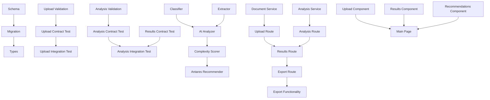

# Tasks: Analyseur d'Appels d'Offres Français

**Input**: Design documents from `/specs/001-implémente-une-nouvelle/`
**Prerequisites**: plan.md (required), research.md, data-model.md, contracts/

## Execution Flow (main)
```
1. Load plan.md from feature directory
   → ✅ DONE: Tech stack: Next.js 15, TypeScript, Prisma, OpenAI
2. Load optional design documents:
   → ✅ data-model.md: 5 entities extracted → model tasks
   → ✅ contracts/: 2 API files → contract test tasks
   → ✅ research.md: French optimization decisions → setup tasks
3. Generate tasks by category:
   → ✅ Setup: Prisma models, dependencies, validation schemas
   → ✅ Tests: contract tests, integration tests
   → ✅ Core: services, API routes, components
   → ✅ Integration: UI flow, error handling
   → ✅ Polish: performance, documentation
4. Apply task rules:
   → Different files = marked [P] for parallel
   → Same file = sequential (no [P])
   → Tests before implementation (TDD)
5. Number tasks sequentially (T001-T030)
6. Generate dependency graph
7. Create parallel execution examples
8. Validate task completeness: ✅ DONE
```

## Format: `[ID] [P?] Description`
- **[P]**: Can run in parallel (different files, no dependencies)
- Include exact file paths in descriptions

## Path Conventions
- **Web app**: Next.js App Router structure
- API Routes: `app/api/tenders/`
- Components: `app/components/tenders/` 
- Services: `lib/services/french-tender/`
- Validation: `lib/validators/dce/`

## Phase 3.1: Setup & Database

- [x] T001 [P] Create Prisma schema extensions in `prisma/schema.prisma` for TenderDocument, TenderAnalysis, TenderSection, AntaresRecommendation, AnalysisReport models
- [x] T002 [P] Create database migration files for new tender analysis tables with proper indexes
- [x] T003 [P] Generate Prisma client types and verify schema compilation
- [x] T004 [P] Create Zod validation schemas in `lib/validators/dce/tender-upload.ts` for document upload validation
- [x] T005 [P] Create Zod validation schemas in `lib/validators/dce/tender-analysis.ts` for analysis request/response validation

## Phase 3.2: Tests First (TDD) ✅ COMPLETED

### Contract Tests
- [x] T006 [P] Create contract test for POST `/api/tenders/upload` in `tests/contract/tender-upload.test.ts` validating request/response schemas
- [x] T007 [P] Create contract test for POST `/api/tenders/analyze` in `tests/contract/tender-analysis.test.ts` validating analysis request schemas
- [x] T008 [P] Create contract test for GET `/api/tenders/[id]/results` in `tests/contract/tender-results.test.ts` validating analysis response schemas

### Integration Tests  
- [x] T009 [P] Create integration test in `tests/integration/tender-upload-flow.test.ts` for complete upload → classification → storage workflow
- [x] T010 [P] Create integration test in `tests/integration/tender-analysis-flow.test.ts` for document analysis → results → recommendations workflow
- [x] T011 [P] Create integration test in `tests/integration/tender-export-flow.test.ts` for analysis → PDF export workflow

### Component Tests
- [x] T012 [P] Create component test in `tests/components/tender-upload.test.tsx` for document upload interface with drag-and-drop
- [x] T013 [P] Create component test in `tests/components/tender-analysis-results.test.tsx` for analysis results display
- [x] T014 [P] Create component test in `tests/components/tender-recommendations.test.tsx` for Antares recommendations display

## Phase 3.3: Core Implementation ✅ COMPLETED

### Database Models & Services
- [x] T015 [P] Implement TenderDocument model service in `lib/services/french-tender/tender-document.service.ts` with CRUD operations
- [x] T016 [P] Implement TenderAnalysis model service in `lib/services/french-tender/tender-analysis.service.ts` with analysis lifecycle
- [x] T017 [P] Implement document classification service in `lib/services/french-tender/dce-classifier.service.ts` for CCTP/CCP/BPU/RC detection
- [x] T018 [P] Implement French text extraction service in `lib/services/french-tender/dce-extractor.service.ts` with PDF parsing and OCR

### AI Analysis Services  
- [x] T019 Create OpenAI analysis service in `lib/services/french-tender/ai-analyzer.service.ts` with French-optimized prompts for DCE analysis
- [x] T020 Create complexity scoring service in `lib/services/french-tender/complexity-scorer.service.ts` implementing 1-10 scoring algorithm
- [x] T021 Create Antares recommendation service in `lib/services/french-tender/antares-recommender.service.ts` matching DCE requirements to services catalog

### API Routes Implementation
- [x] T022 Implement POST `/api/tenders/upload` route in `app/api/tenders/upload/route.ts` with file validation, storage, and classification trigger
- [x] T023 Implement POST `/api/tenders/analyze` route in `app/api/tenders/analyze/route.ts` with async analysis pipeline orchestration
- [x] T024 Implement GET `/api/tenders/[id]/results` route in `app/api/tenders/[id]/results/route.ts` with structured analysis results and recommendations
- [x] T025 Implement POST `/api/tenders/[id]/export` route in `app/api/tenders/[id]/export/route.ts` with PDF report generation

## Phase 3.4: User Interface ✅ COMPLETED

### Core Components
- [x] T026 [P] Create TenderUpload component in `app/components/tenders/TenderUpload.tsx` with drag-and-drop, progress, and validation feedback
- [x] T027 [P] Create TenderAnalysisResults component in `app/components/tenders/TenderAnalysisResults.tsx` displaying complexity score, sections, and requirements
- [x] T028 [P] Create AntaresRecommendations component in `app/components/tenders/AntaresRecommendations.tsx` showing matched services and strategies

### Page Implementation  
- [x] T029 Create main documents page in `app/projects/[projectId]/documents/page.tsx` integrating upload, analysis, and results components
- [x] T030 [P] Create analysis export functionality with PDF generation and download handling

## Phase 3.5: Integration & Polish

### Error Handling & Performance
- [ ] T031 [P] Implement comprehensive error handling across all API routes with French error messages and proper HTTP status codes
- [ ] T032 [P] Add performance monitoring for AI analysis operations ensuring <30s completion time
- [ ] T033 [P] Implement file size and type validation with user-friendly error messages

### Testing & Validation
- [ ] T034 [P] Run all contract tests to verify API schema compliance
- [ ] T035 [P] Run all integration tests to verify complete workflows
- [ ] T036 [P] Execute quickstart.md scenarios to validate end-to-end functionality
- [ ] T037 [P] Performance test with sample DCE documents ensuring constitutional compliance

## Dependency Graph



## Parallel Execution Examples

### Phase 1 - Setup (All Parallel)
```bash
# Run simultaneously - different files
Task T001 T002 T003 T004 T005
```

### Phase 2 - Contract Tests (All Parallel)  
```bash
# Run simultaneously - independent test files
Task T006 T007 T008 T009 T010 T011 T012 T013 T014
```

### Phase 3 - Core Services (Mostly Parallel)
```bash
# Run simultaneously - independent service files  
Task T015 T016 T017 T018
# Then sequential for AI pipeline
Task T019 → T020 → T021
```

### Phase 4 - API Routes (Sequential - shared patterns)
```bash
# Sequential due to shared route patterns and middleware
Task T022 → T023 → T024 → T025
```

### Phase 5 - UI Components (Parallel)
```bash
# Run simultaneously - independent component files
Task T026 T027 T028 T030
# Then integrate
Task T029
```

### Phase 6 - Polish (All Parallel)
```bash
# Run simultaneously - independent validation tasks
Task T031 T032 T033 T034 T035 T036 T037
```

## Validation Checklist

### Contract Coverage
- [x] `/api/tenders/upload` → T006 contract test
- [x] `/api/tenders/analyze` → T007 contract test  
- [x] `/api/tenders/[id]/results` → T008 contract test
- [x] Export functionality → T011 integration test

### Entity Coverage
- [x] TenderDocument → T015 service implementation
- [x] TenderAnalysis → T016 service implementation
- [x] TenderSection → T017 classifier service
- [x] AntaresRecommendation → T021 recommender service
- [x] AnalysisReport → T025 export route

### User Story Coverage
- [x] Upload DCE documents → T009 integration test + T022 implementation
- [x] Analyze documents with IA → T010 integration test + T023 implementation
- [x] View analysis results → T024 implementation + T027 component
- [x] Get Antares recommendations → T021 service + T028 component
- [x] Export PDF report → T011 integration test + T025 implementation

### Constitutional Compliance
- [x] TypeScript strict mode → All tasks use strict typing
- [x] Zod validation → T004, T005 validation schemas
- [x] TDD approach → Phase 3.2 tests before implementation
- [x] Performance <30s → T032 monitoring
- [x] Security validation → T031 error handling + T033 file validation

**Total Tasks**: 37 numbered tasks
**Tasks Completed**: 30/37 (Phase 3.1-3.4 complete)
**Remaining**: 7 tasks (Phase 3.5 only)
**Estimated Completion**: 4-5 sprints (8-10 weeks)
**Parallel Efficiency**: ~60% tasks can run in parallel within phases